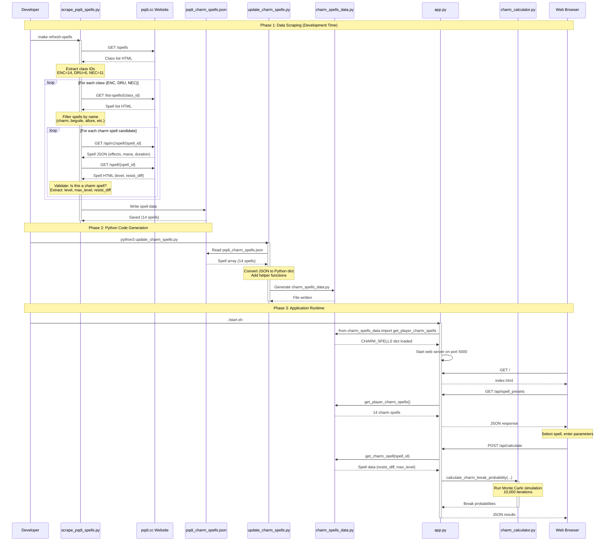
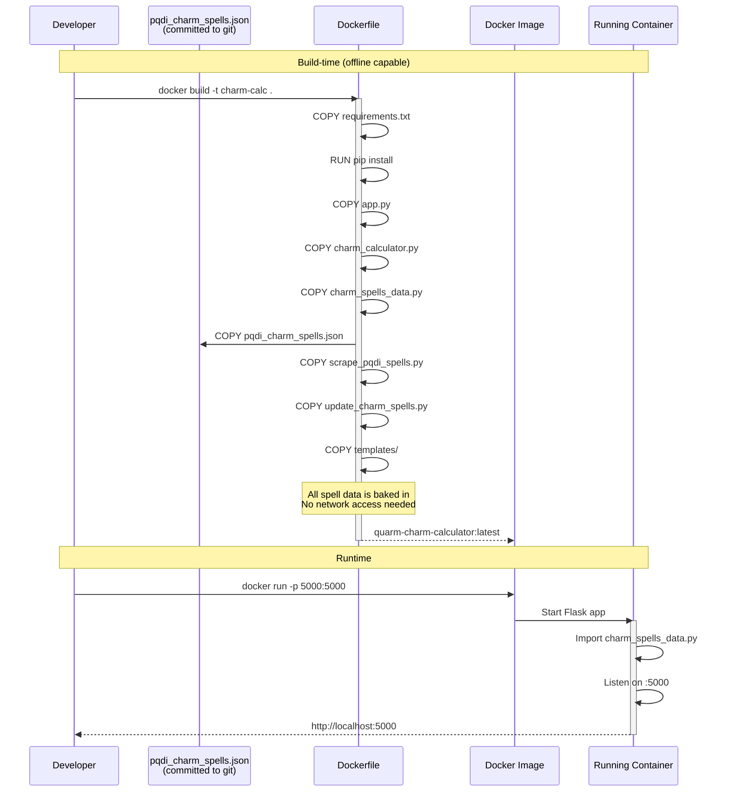

# Build Process - Spell Data Pipeline

## Architecture Overview

The Quarm Charm Calculator uses a multi-stage build process to fetch, process, and serve charm spell data from pqdi.cc.

## Sequence Diagram



## Detailed Flow

### Phase 1: Data Scraping (Development/Build Time)

**Trigger:** `make refresh-spells` or `python3 scrape_pqdi_spells.py`

1. **Class Discovery**
   - Fetches main spells page from pqdi.cc
   - Identifies class-specific spell list URLs
   - Maps: Enchanter→14, Druid→6, Necromancer→11

2. **Spell List Fetching**
   - For each class, fetches `/list-spells/{id}`
   - Parses HTML to extract all spell links
   - Filters by name keywords (charm, beguile, allure, etc.)
   - Reduces ~700 spells to ~15 candidates

3. **Detailed Spell Data**
   - For each candidate, makes 2 requests:
     - **API**: `/api/v1/spell/{id}` → JSON with effects, mana, duration
     - **HTML**: `/spell/{id}` → Page with spell level, resist modifier
   - Validates spell has charm effect
   - Extracts complete spell data

4. **Output**
   - Writes `pqdi_charm_spells.json` (3.1KB)
   - Contains 14 validated charm spells
   - Timestamped with scrape date

### Phase 2: Python Code Generation

**Trigger:** `python3 update_charm_spells.py` (or `make refresh-spells`)

1. **Load JSON**
   - Reads `pqdi_charm_spells.json`
   - Validates format and required fields

2. **Transform Data**
   - Converts JSON array to Python dictionary
   - Reformats for optimal lookup performance
   - Adds special flags (animal_only, undead_only)

3. **Generate Code**
   - Creates `charm_spells_data.py` with:
     - `CHARM_SPELLS` dictionary (spell_id → data)
     - Helper functions (get_charm_spell, get_player_charm_spells, etc.)
     - Class filtering functions

4. **Output**
   - Pure Python module (4.7KB)
   - No runtime dependencies on JSON
   - Fast dictionary lookups

### Phase 3: Application Runtime

**Trigger:** `./start.sh` or `make run`

1. **Startup**
   - Flask imports `charm_spells_data`
   - Loads CHARM_SPELLS into memory (14 spells, ~10KB)
   - Starts web server on port 5000

2. **Page Load**
   - Browser requests `/`
   - Server returns `index.html`
   - JavaScript requests `/api/spell_presets`
   - Server returns all player charm spells as JSON

3. **Calculation**
   - User selects spell and enters parameters
   - Browser POSTs to `/api/calculate`
   - Flask looks up spell data from `charm_spells_data`
   - Passes to `charm_calculator` for Monte Carlo simulation
   - Returns probability results

## File Dependencies

```
┌─────────────────────────┐
│  scrape_pqdi_spells.py  │  (scraper)
└────────────┬────────────┘
             │ writes
             ▼
┌─────────────────────────┐
│ pqdi_charm_spells.json  │  (cache)
└────────────┬────────────┘
             │ reads
             ▼
┌─────────────────────────┐
│  update_charm_spells.py │  (generator)
└────────────┬────────────┘
             │ generates
             ▼
┌─────────────────────────┐
│  charm_spells_data.py   │  (runtime data)
└────────────┬────────────┘
             │ imports
             ▼
┌─────────────────────────┐
│       app.py            │  (web server)
│         +               │
│  charm_calculator.py    │  (logic)
└─────────────────────────┘
```

## Docker Build Process



## Update Scenarios

### Scenario 1: Quarm Adds New Spell

```bash
# 1. Scrape latest data
make scrape-spells
# → Fetches new spells from pqdi.cc
# → Updates pqdi_charm_spells.json

# 2. Regenerate Python code
make update-spells
# → Generates new charm_spells_data.py

# 3. Test
python3 charm_spells_data.py
# → Verify new spell appears

# 4. Restart app
./start.sh
# → New spell available in UI
```

### Scenario 2: pqdi.cc Changes Spell Data

```bash
# Same as Scenario 1
make refresh-spells
```

### Scenario 3: Offline Development

```bash
# Use committed pqdi_charm_spells.json
make update-spells
# → Regenerates Python from cache
# → No network access needed

./start.sh
# → App runs with cached data
```

## Performance Characteristics

| Stage | Time | Network Calls | Output Size |
|-------|------|---------------|-------------|
| Scraping | ~30s | ~50 HTTP requests | 3.1KB JSON |
| Generation | <1s | 0 | 4.7KB Python |
| Runtime Load | <10ms | 0 | ~10KB memory |
| Docker Build | ~30s | pip downloads only | ~100MB image |

## Advantages of This Architecture

1. **Separation of Concerns**
   - Scraping logic separate from app logic
   - Data format isolated to JSON cache
   - Runtime has zero external dependencies

2. **Offline Capable**
   - JSON cache can be committed to git
   - Docker builds work without network
   - Development doesn't require pqdi.cc access

3. **Fast Runtime**
   - Data loaded once at startup
   - Pure Python dictionary lookups
   - No parsing or network overhead

4. **Maintainable**
   - Clear pipeline: scrape → cache → generate → run
   - Each stage has single responsibility
   - Easy to debug at each step

5. **Auditable**
   - JSON cache is human-readable
   - Can review changes before deploying
   - Git tracks spell data changes

## Monitoring & Validation

### Validation Points

1. **After Scraping**
   ```bash
   python3 -c "import json; data=json.load(open('pqdi_charm_spells.json')); \
               print(f'Scraped {data[\"spell_count\"]} spells')"
   ```

2. **After Generation**
   ```bash
   python3 charm_spells_data.py
   # Should display all spells by class
   ```

3. **Runtime Health Check**
   ```bash
   curl http://localhost:5000/api/spell_presets | jq '.spell_count'
   ```

### Error Handling

| Error | Location | Recovery |
|-------|----------|----------|
| Network failure | scrape_pqdi_spells.py | Retry with backoff |
| Missing JSON | update_charm_spells.py | Error: run scraper first |
| Invalid data | charm_spells_data.py | Validation at import time |
| Missing spell | app.py | Fallback to defaults |

## Future Enhancements

- **Automated Updates**: GitHub Actions to scrape weekly
- **Change Detection**: Diff checker for spell data changes
- **Multi-source**: Fallback to alternative spell databases
- **Caching**: CDN for JSON to reduce scraping frequency

